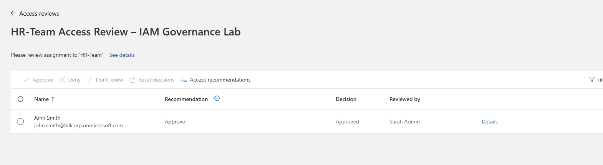

# Entra ID Identity & Access Management (IAM) Governance Lab

# Microsoft Entra ID IAM Lab – User & Access Management

## 📌 Overview

This project simulates a real-world IAM environment using Microsoft Entra ID, focusing on user provisioning, group-based access control, RBAC, Conditional Access (MFA), and Privileged Identity Management (PIM).
---

## 🧠 Objectives

* Create and manage users in Microsoft Entra ID
* Implement group-based access control (RBAC model)
* Assign users to department-based groups
* Investigate and troubleshoot access/permission issues

---

## 🏢 Environment

* Platform: Microsoft Entra ID
* Tenant Type: Cloud-based directory
* Access Level: Limited (non-admin user)

---

## 👤 User Provisioning

Created the following users to simulate employees:

* Sarah Johnson (HR)
* Mike Chen (IT)
* David Lee (Finance)

These users represent different departments within an organization.

---

## 👥 Group Management

Created security groups to organize access by department:

* HR Team
* IT Team
* Finance Team

Users were assigned to their respective groups to simulate real-world access management.

---

## 🔗 Group-Based Access Control

Instead of assigning permissions directly to users, access was structured using groups:

* Sarah Johnson → HR Team
* Mike Chen → IT Team
* David Lee → Finance Team

This approach reflects the principle of scalable and maintainable IAM design.

---

## 🔐 Role-Based Access Control (RBAC)

Attempted to assign administrative roles (e.g., User Administrator) to groups and users.

### 🚨 Result:

* Role assignment was not permitted due to insufficient privileges

### 🧠 Analysis:

This behavior demonstrates the principle of **least privilege**, where users are restricted from performing administrative actions unless explicitly granted permissions.

---

## 🚨 Troubleshooting Scenario

### Scenario:

A user (Sarah Johnson) required elevated permissions to manage users but was unable to perform administrative actions.

### Investigation Steps:

1. Verified user account exists
2. Confirmed group membership (HR Team)
3. Checked for assigned roles
4. Attempted role assignment

### 🔎 Root Cause Identified:
Lack of assigned administrative role and insufficient privileges to perform RBAC role assignment.

### Resolution:

* Identified that role assignment requires higher privileges (e.g., Global Administrator or User Administrator)
* Escalation would be required in a real-world scenario

---

## 📸 Screenshots

### Users Created

### Groups Created

### Group Membership

### Role Assignment Limitation

(Screenshots stored in `/screenshots` folder)

---

🔐 Conditional Access & MFA

To enhance security, a Conditional Access policy was implemented:

- Created policy: Require MFA for all users
- Applied to: All cloud applications
- Configured to require Multi-Factor Authentication (MFA)
- Excluded admin account to prevent lockout

🧪 Testing:
- Logged in as standard users
- Prompted for MFA setup using Microsoft Authenticator
- Successfully completed MFA challenge

📸 Screenshots

### MFA Prompt During Login
User is prompted for multi-factor authentication after Conditional Access policy enforcement.

---

### Conditional Access Policy Configuration
Policy configured to require MFA for all users accessing cloud applications.

---

### PIM Eligible Role Assignment
User Administrator role assigned as eligible, requiring activation before use.

---

### PIM Role Activation
User activates role with justification and time-bound access.

---

### PIM Active Role
Role successfully activated with temporary elevated privileges.

---

🔐 Privileged Identity Management (PIM)

To enforce least privilege and just-in-time access:

- Removed permanent User Administrator role from Sarah Admin
- Assigned role as **Eligible** using PIM
- Required:
  - MFA
  - Justification
  - Time-bound activation

🧪 Testing:
- Logged in as Sarah Admin
- Navigated to PIM → My Roles
- Activated User Administrator role
- Completed MFA and justification
- Verified role changed from Eligible → Active

  ## 🔍 Access Reviews (Identity Governance)

Implemented an access review to validate group membership and enforce least privilege.

### Configuration
- Review Target: HR-Team (group)
- Reviewer: Sarah Admin
- Review Type: One-time review
- Duration: 3 days
- Auto-apply results: Enabled
- No response action: Remove access
- Justification required: Enabled

### Review Execution
Access review was completed by the designated reviewer.

- User Reviewed: John Smith
- Recommendation: Approve
- Final Decision: Approved
- Reviewed By: Sarah Admin

### Outcome
User access was validated and retained based on business need.

### Screenshots

Access Review - Decision  

## 🔐 Enterprise Application Access Management (ServiceNow)

Expanded the IAM governance lab by onboarding ServiceNow as an Enterprise Application in Microsoft Entra ID to simulate SaaS application access provisioning and Single Sign-On (SSO) administration.

### Configuration

* Application Added: ServiceNow (Enterprise Application)
* Access Model: Group-based assignments

### Assigned Groups

* HR-Team → User access
* IT-Admins → User access

### Single Sign-On Review

Reviewed supported SSO methods:

* SAML
* Linked Sign-on
* Disabled

Reviewed required federation settings:

* Identifier (Entity ID)
* Reply URL (Assertion Consumer Service URL)
* Sign-on URL
* Attributes & Claims
* Signing Certificate

### Outcome

Demonstrated centralized SaaS access management and identity federation concepts using Microsoft Entra ID.

Screenshots

ServiceNow Users and Groups

SSO Method Selection

SAML Configuration

## 🧠 Key Takeaways

* IAM should follow **group-based access control**, not direct user assignment
* Role-Based Access Control (RBAC) enforces permission boundaries
* The **principle of least privilege** restricts unauthorized actions
* Troubleshooting access issues requires validating users, groups, and roles

---

## 💼 Skills Demonstrated

* Identity and Access Management (IAM)
* User provisioning and lifecycle management
* Group-based access control
* Role-Based Access Control (RBAC) configuration and troubleshooting
* Conditional Access policy implementation
* Multi-Factor Authentication (MFA) enforcement
* Privileged Identity Management (PIM) for just-in-time access
* Security best practices (least privilege, zero trust)
* Sign-in log analysis and access validation
* Identity Governance (Access Reviews)
* Access certification and periodic access validation
* Enforcement of least privilege through automated review workflows
* Enterprise Application Management
* Single Sign-On (SSO)
* SAML Federation Concepts
* SaaS Access Governance
* Application Provisioning

---

## 🚀 Future Improvements

* Implement recurring access reviews and automated lifecycle governance
* Automate user lifecycle management (joiner/mover/leaver)
* Integrate with on-prem Active Directory (hybrid identity)
* Configure approval workflows for PIM role activation

---

## 🧩 Real-World Relevance
This lab simulates enterprise IAM operations, including user onboarding, group-based access control, MFA enforcement through Conditional Access, and just-in-time privileged access using Privileged Identity Management (PIM). These configurations reflect real-world security practices such as least privilege, zero trust, and privileged access governance used in modern organizations.
---
